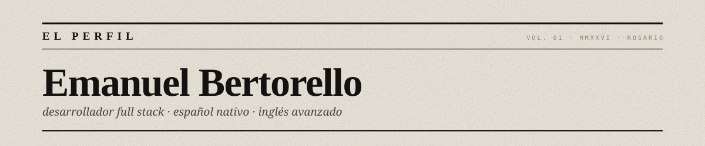

  

  

  
  
  
  
  
  
  
  

  <a href="https://www.linkedin.com/in/emanuel-bertorello-84a425219">LinkedIn</a>
  &nbsp;·&nbsp;
  <a href="mailto:emanuel.berto19@gmail.com">emanuel.berto19@gmail.com</a>

