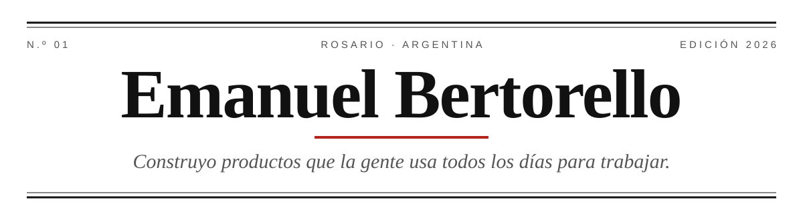

<picture>
  <source media="(prefers-color-scheme: dark)" srcset="assets/cabecera-oscura.svg">
  
</picture>

  <b>DESARROLLADOR FULL STACK</b> &nbsp;·&nbsp; ESPAÑOL NATIVO &nbsp;·&nbsp; INGLÉS AVANZADO

 

> ### «Hago el producto entero: la interfaz, la API, la base de datos, el deploy y el equipo que está en la planta leyendo un indicador de peso.»

Me interesa el software que resuelve un problema concreto y medible. Escribo código pensando en quien lo va a leer dentro de seis meses.

 

---

<b>EN TAPA</b>

<h2 align="center">Pesar RED</h2>

<i>Una plataforma para gestionar básculas de camiones, de punta a punta.</i>

Un camión llega a la planta, se identifica con un QR, la balanza toma el peso sola y el sistema hace el resto: emite el ticket, descuenta el stock y le imputa el consumo a la cuenta corriente del cliente. Reemplaza planillas de papel que se pierden y cierres de stock que se cruzan a mano.

<table>
  <tr>
    <td width="33%" valign="top">
      <b>I · EL TÓTEM</b>  
      Python y PySide6 en la balanza. Habla Modbus con el indicador de peso, dispara cámaras IP, imprime tickets y guarda todo local, para que un corte de internet no frene al camión.
    </td>
    <td width="33%" valign="top">
      <b>II · LA NUBE</b>  
      TypeScript sobre AWS Lambda, PostgreSQL en RDS. Emisión de QR, cierre de pesadas idempotente, stock, cuentas corrientes y facturación mensual automática.
    </td>
    <td width="33%" valign="top">
      <b>III · EL PORTAL</b>  
      Angular, con un portal para cada uno que entra: el dueño de la balanza, la empresa cliente, el chofer y la administración. Monitoreo en vivo del peso, los semáforos y las cámaras.
    </td>
  </tr>
</table>

 

**Además, en esta edición**

- **Actualización remota** de los tótems, con paquetes firmados y asignación por balanza.
- **Demostraciones con balanza virtual:** un simulador que usa las mismas rutas que un tótem real, para mostrar el circuito completo sin instalar nada.
- **Funcionamiento sin internet:** el tótem valida pases y guarda las pesadas localmente, y las sincroniza cuando vuelve la conexión.

 

---

<b>EN NÚMEROS</b>

  

---

<b>HERRAMIENTAS</b>

  <b>Front</b> &nbsp; Angular · TypeScript · Tailwind 
  <b>Back</b> &nbsp; Node.js · Python · PostgreSQL 
  <b>Infra</b> &nbsp; AWS · Git

---

<b>CONTACTO</b>

  <a href="https://www.linkedin.com/in/emanuel-bertorello-84a425219">LinkedIn</a>
  &nbsp;·&nbsp;
  <a href="mailto:emanuel.berto19@gmail.com">emanuel.berto19@gmail.com</a>

